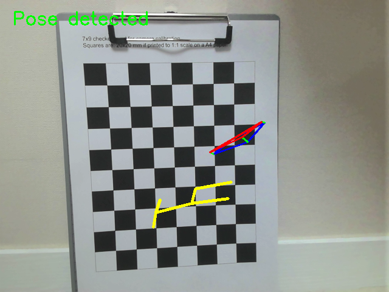
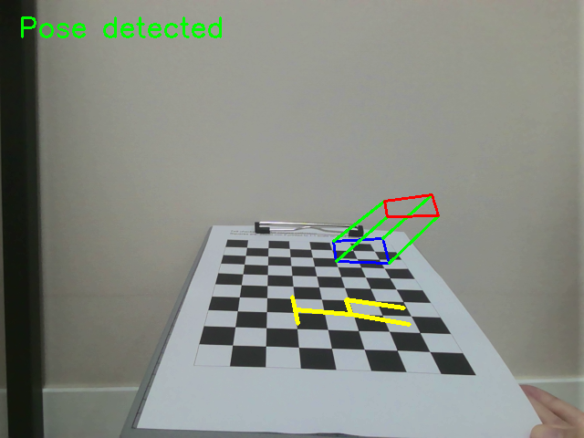
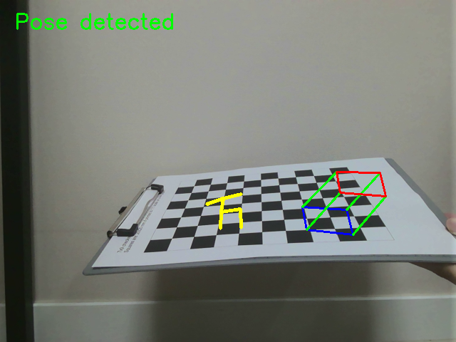
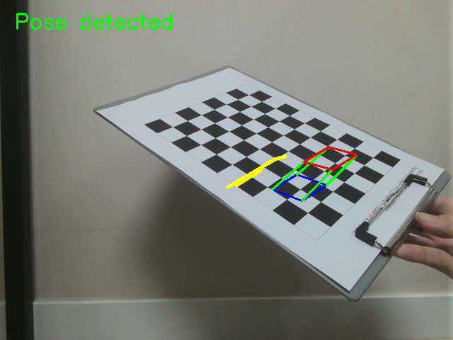
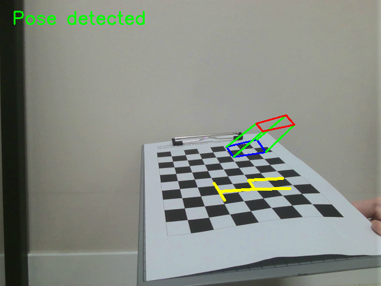

# chessboard-ar-pose-estimation
Real-time camera pose estimation and AR visualization using OpenCV and chessboard pattern

This project implements camera pose estimation and augmented reality (AR) visualization using a chessboard pattern and OpenCV.

---

##  Overview

The goal of this project is to estimate the camera pose from a calibrated camera and visualize virtual objects on a real-world chessboard in real time.

The system detects chessboard corners, computes camera pose using the intrinsic parameters, and overlays AR objects that follow the camera movement.

---

##  Features

* Camera calibration using multiple chessboard images
* Real-time camera pose estimation (`solvePnP`)
* AR object rendering on chessboard
* Stable tracking under different viewpoints

---

##  Requirements

* Python 3
* OpenCV
* NumPy

Install required packages:

```
pip install opencv-python numpy
```

---

##  File Description

* `camera_calibration.py`
  → Computes camera intrinsic parameters from chessboard images

* `calibration_result.npz`
  → Saved camera matrix and distortion coefficients

* `ar_chessboard.py`
  → Real-time AR visualization using webcam

---

##  How to Run

### 1. Camera Calibration

Place calibration images in the `images/` folder, then run:

```
python camera_calibration.py
```

This generates:

```
calibration_result.npz
```

---

### 2. AR Visualization

Run:

```
python ar_chessboard.py
```

Controls:

* `s` : Save screenshot
* `q` : Quit

---

##  Result

The AR object is rendered on the chessboard and follows the camera movement in real time.

### Example 1



### Example 2



### Example 3



### Example 4



### Example 5



---

##  Description

The system first calibrates the camera using multiple chessboard images to obtain intrinsic parameters.

Then, during runtime, it detects chessboard corners and estimates the camera pose using `solvePnP`.
Finally, virtual objects are projected onto the image using `projectPoints`.

The AR object remains aligned with the chessboard even when the camera moves, demonstrating accurate pose estimation.

---

## ✅ Conclusion

This project successfully demonstrates real-time camera pose estimation and AR visualization using OpenCV.

The system is robust under different viewing angles and provides stable AR rendering on a planar surface.
